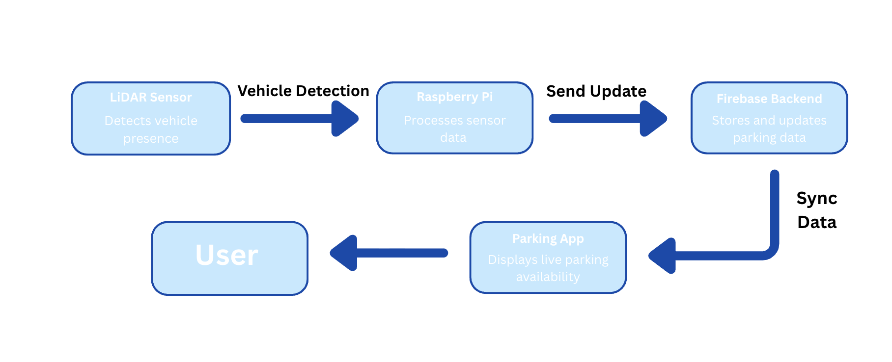
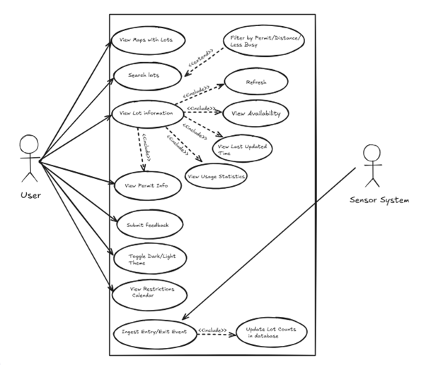
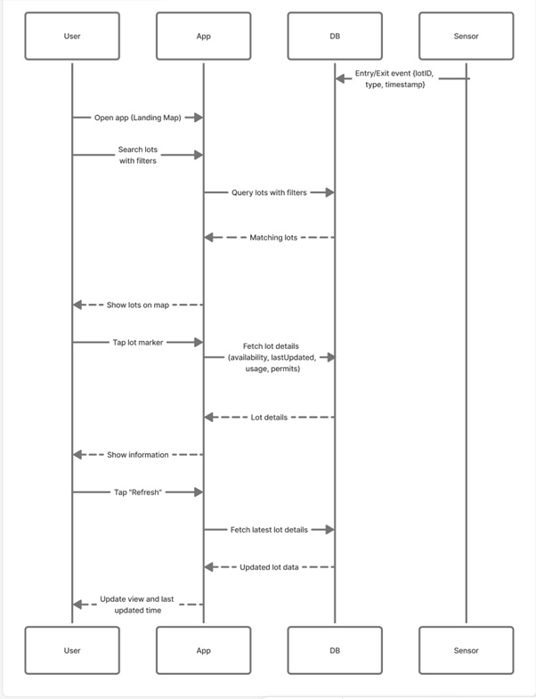
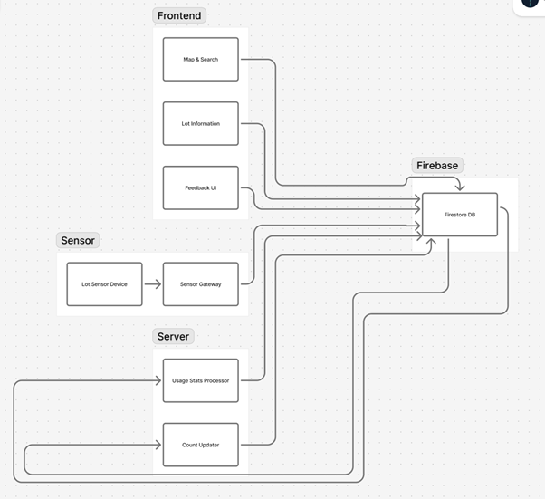

# KU Smart Parking App

Course: EECS 582 Capstone  
Team Number: 1  

Team Members:  
Sabeen Ahmad  
Sriya Annem  
Tanushri Sakaray  
Samantha Adorno  
Anna Ross  

**Live Demo:** [parking-capstone-9778c.web.app](https://parking-capstone-9778c.web.app/) *(currently in development)*

---

## Project Overview

The KU Smart Parking App is a web application designed to provide real-time parking availability for parking lots on the University of Kansas campus.

The system integrates a React-based frontend, Firebase cloud backend services, and a LiDAR sensing prototype to monitor parking occupancy. The goal is to help students, faculty, and visitors make informed parking decisions by providing live parking availability, permit restrictions, and historical parking trends through an intuitive map-based interface.

In the current prototype, the Central Parking Garage uses a LiDAR-based sensor connected to a Raspberry Pi to detect vehicle entry and exit events. Other parking lots use mocked data during development.

Future versions aim to expand real-time sensing across additional campus parking locations.

---

## System Architecture

The system follows a client–server architecture with cloud-based backend services.

- The frontend is implemented using React and provides the interactive user interface.
- The backend uses Firebase services including Firestore and Cloud Functions.
- A LiDAR sensor connected to a Raspberry Pi detects vehicle entry and exit events and sends them to the backend.

Firestore enables real-time data synchronization so updates are automatically pushed to all connected clients.

---

## System Components

### Frontend

The frontend is built using React and provides the main user interface for interacting with parking data.

Key features include:

#### Map View (Landing Page)

The main interface displays a map of the KU campus with markers representing parking lots.

Users can:

- View lot availability
- Search for lots by permit type
- Locate nearby parking
- Select a lot to view more detailed information

#### Lot Details Page

Selecting a parking lot displays detailed information including:

- Total parking capacity
- Current available spaces
- Last update timestamp
- Occupancy progress bar
- Hourly activity chart
- Permit types allowed

Data is retrieved from Firestore using real-time listeners.

#### Navigation Menu

The application includes a navigation menu providing access to:

- Bug report submission
- Theme switching (light and dark mode)
- Campus events calendar

#### Chatbot

The application includes a chatbot that allows users to ask questions about parking availability and campus parking policies.

Example queries include:

- Where is the closest available garage?
- Which lots allow green permits?
- What parking is available near engineering buildings?

The chatbot queries Firebase for relevant parking data and provides structured responses.

---

### Backend

The backend uses Firebase Cloud Services including:

- Firestore
- Firebase Cloud Functions
- Firebase Hosting

Each parking lot is stored as a document containing both static and dynamic data.

Example fields include:

- lot name
- total capacity
- available spaces
- last updated timestamp
- historical occupancy statistics

#### Cloud Functions

Firebase Cloud Functions process events from parking sensors and update the database.

Responsibilities include:

- Validating sensor events
- Recording entry and exit events
- Updating lot occupancy counts
- Triggering statistical updates

This architecture ensures secure and consistent updates while keeping sensing logic off the client.

---

### Sensor Layer

The prototype uses a LiDAR sensor connected to a Raspberry Pi to detect vehicle entry and exit events.

The Raspberry Pi processes LiDAR distance measurements to detect vehicle movement and sends structured events to the backend via HTTP requests.

To improve reliability:

- Events are validated by Cloud Functions
- Sensor thresholds are configurable
- Events can be buffered locally if connectivity is lost

This design enables reliable real-time parking detection and supports future sensor expansion.

---

## Data Flow

1. A user opens the application and selects a parking lot from the map.

2. The frontend requests parking data from Firestore.

3. React components render parking availability and historical statistics.

4. The LiDAR sensor detects vehicle entry or exit.

5. The Raspberry Pi sends an event to a Cloud Function.

6. The Cloud Function updates the Firestore database.

7. Firestore pushes updates to all connected clients in real time.

---

## Non-Functional Requirements

**Scalability**

Firebase's serverless architecture allows the system to scale to additional parking lots without infrastructure changes.

**Reliability**

Firestore provides real-time replication and high availability.

**Performance**

React enables efficient UI rendering and responsive interaction with live data.

**Security**

All database operations are protected using Firebase authentication and Firestore security rules.

**Maintainability**

The system uses a modular architecture separating the frontend, backend, and sensing layers.

---

## UML Diagrams

### Use Case Diagram

*Figure 1. Use case diagram showing how users interact with the parking system and how sensor events update parking lot counts.*

---

### System Sequence Diagram

*Figure 2. Sequence diagram illustrating how the user, application, database, and sensor system interact when retrieving parking lot information.*

---

### System Architecture Diagram

*Figure 3. High-level architecture of the KU Parking App including the frontend, Firebase backend, and LiDAR sensor system.*

---

## Technology Stack

### Frontend

React  
Expo Web  
TypeScript  
Leaflet  

### Backend

Firebase Firestore  
Firebase Cloud Functions
Firebase Cloud Scheduling
Node.js  

### Hardware

Raspberry Pi  
LiDAR Sensor  

---
